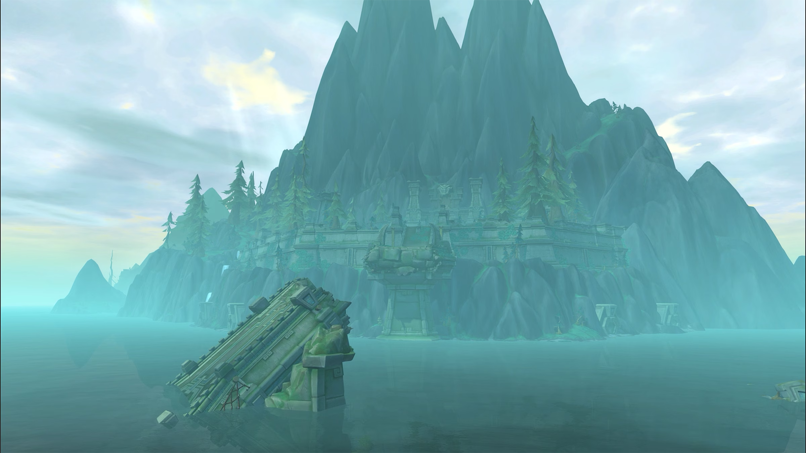

<p align="center">
  
</p>

# wxl-modern-wmo

[Build compatibility and release gate](BUILDING.md)

**Loads world map objects authored for newer versions of the game, natively.**

A [WarcraftXL](https://github.com/WarcraftXL/wxl-core) extension. The client's WMO loader walks each
chunk positionally, assuming a fixed order; a WMO authored later adds chunks it has no slot for, which
desynchronizes the whole parse. This module replaces the positional walker with a tag-driven one, reads
the file directly, and fills the client's own root/group runtime with it. No conversion step, no
intermediate file, and root/group loads run off the main thread so loading is instant.

See [`store/description.md`](store/description.md) for the full write-up (materials, the four-layer and
composite shader fixes, the outdoor-visibility rule, and the interface contract).

## Highlights

- **Direct native read**: a tag-driven chunk walker, in memory, no on-disk transform.
- **Instant loading**: root and group walks run on a background thread; the main thread only ever checks
  a readiness flag.
- **Four-layer materials**: the stock single-layer shader is patched in memory to blend all four diffuse
  layers a modern material carries, falling back to stock behavior if any prerequisite is missing.
- **Composite overlay fix**: the second-layer blend is corrected to use the texture's own alpha instead of
  vertex-colour alpha, scoped to modern materials only.
- **Outdoor visibility**: recognizes the ways a modern indoor space can still show the outside (an
  open-sided space like the underside of a bridge) and reopens the exterior the client's own way.
- **Graceful fallback everywhere**: an unresolved texture or a shader that won't patch just draws the way
  the client would have drawn it natively, never a crash.

## Requirements

WarcraftXL on a 3.3.5a client, build 12340. The module refuses to load against anything else rather than
guessing, and says so in the log.

## Building

This extension builds against the exact [compatible core revision](BUILDING.md).
The core discovers a copy under `extensions/wxl-modern-wmo/`; this repository's
workflow checks the Win32 build on pull requests and `main`. It does not publish
a binary release.

## Project layout

```
src/
├── ExtensionApi.hpp/.cpp, Module.cpp   entry points, service-table plumbing
├── load/                               the native chunk walkers, background root/group loading,
│                                       material resolution, vertex-colour contract
└── render/                             the four-layer material, the composite overlay fix, and the
                                        outdoor-visibility rule
```

## License

GPL-3.0-or-later. See the license header in every source file.
